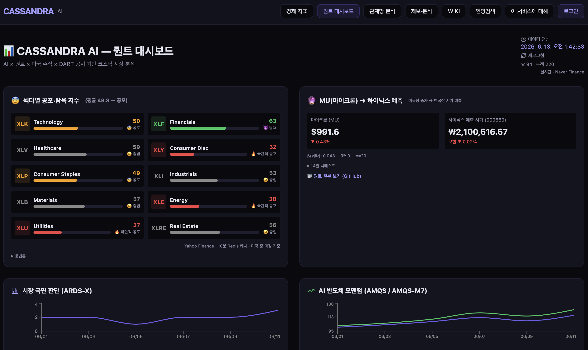
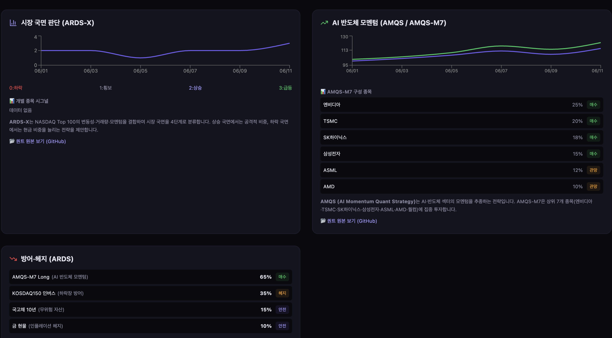
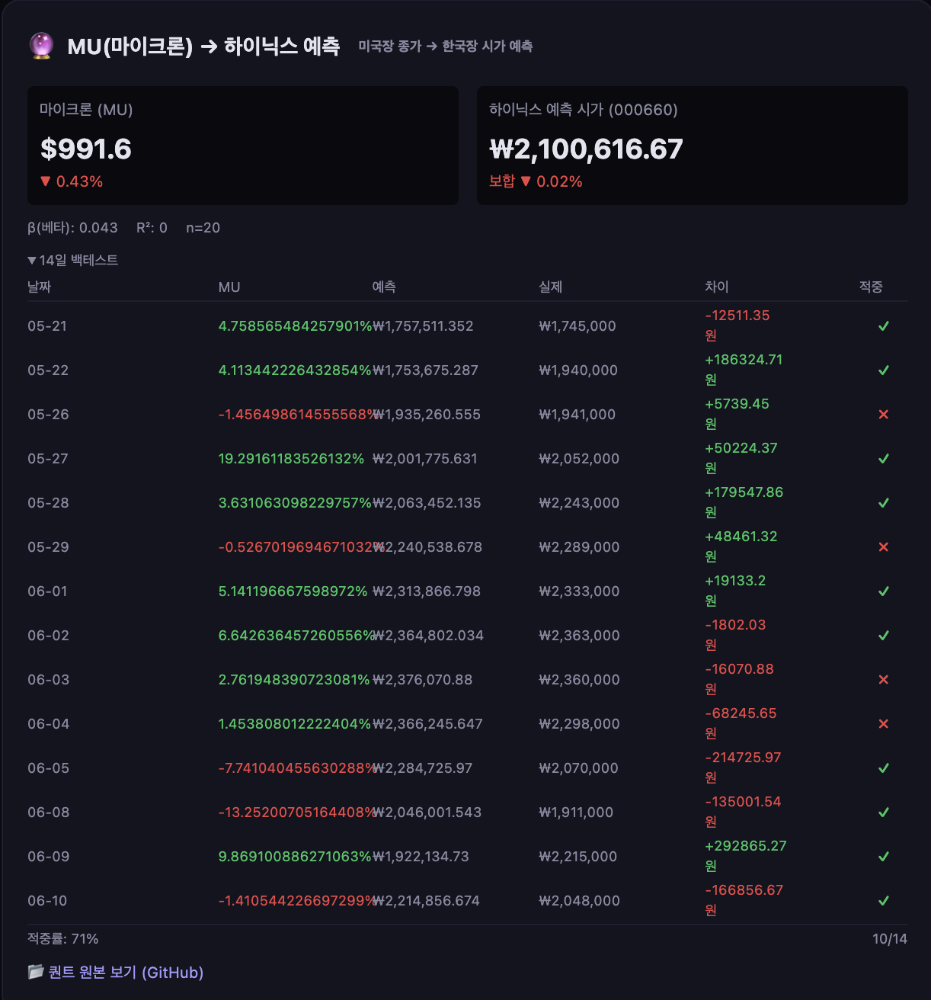

# CASSANDRA AI

> **DART × 퀀트 × LLM 리스크 모니터링**
>
> 코스닥 1,822개 종목 DART 공시 실시간 분석 + 섹터 공포·탐욕 지수 + MU→하이닉스 예측
>
> **$0/월 완전 무료 운영** — Vercel + Neon + Upstash + GitHub Actions

---

## 핵심 아이디어

**GitHub 레포지토리를 무료 JSON 스토리지 + CDN으로 활용**하여 $0 인프라를 구축했습니다.
서버리스 아키텍처로 트래픽이 없을 땐 비용이 0이고, 늘어나도 무료 티어 내에서 운영됩니다.

```
인프라 비용: $0/월
├── Vercel Hobby      → 웹 호스팅 + API ($0)
├── Neon Free         → PostgreSQL 0.5GB ($0)
├── Upstash Redis Free → 캐시 256MB ($0)
├── GitHub Actions    → 크롤러/스크래퍼 (공개 레포 무제한)
└── GitHub Storage    → JSON 데이터 CDN (1GB 한도)
```

## 퀀트 대시보드

**비로그인 공개**: `https://dart-monitor-pi.vercel.app/quant`



### 섹터별 공포·탐욕 지수
Yahoo Finance 실시간 데이터로 10개 미국 섹터 ETF의 투자 심리를 측정합니다.
RSI(14)·이동평균·변동성·섹터모멘텀·거래량 5개 시그널을 가중평균하여 0(공포)~100(탐욕) 점수로 시각화합니다.

| 섹터 | 티커 | 방식 |
|------|------|------|
| Technology | XLK | 5시그널 가중평균 |
| Financials | XLF | RSI 25% + MA 20% + 변동성 20% + 모멘텀 20% + 거래량 15% |
| Healthcare | XLV | 0~39 극단적 공포, 40~49 공포, 50~59 중립, 60~79 탐욕, 80~100 극단적 탐욕 |
| Consumer Disc | XLY | Redis 10분 캐시, 강제 갱신 버튼 |
| ... 외 6개 섹터 | | |

### 개별 종목 시그널 (ARDS-X)



NASDAQ Top 100 기반 VIX·이동평균·RSI·거래량으로 시장 국면을 4단계 판단.
실시간 Naver Finance 가격 데이터로 개별 종목(엔비디아·애플·MS·테슬라·메타·아마존) 스코어를 산출합니다.

### MU(마이크론) → 하이닉스 예측



미국장 마이크론 종가를 기반으로 한국장 하이닉스 시가를 예측하는 크로스마켓 퀀트 모델입니다.
회귀 베타(β)로 두 종목 간 상관도를 계산하고, 14일 백테스트로 적중률을 검증합니다.

- 예측 공식: `Hynix_시가 = Hynix_전일종가 × (1 + |β| × MU_등락률)`
- 백테스트: **71% 적중률 (10/14)**, 14일 히스토리 리스트
- 데이터: Yahoo Finance → Redis 10분 캐시 → DB + GitHub JSON

## 주요 기능

### 검색 + 관계망 분석
- 회사명·인물명·법인명 통합 검색 (3,920개 DART + DB 700개사)
- Cytoscape.js 관계망 (회사↔인물↔법인↔PersonHistory)
- 공시 분석 패널: 위험 신호·카테고리·타임라인
- 실시간 검색어 + 인물 검색 랭킹

### DART 분석 챗봇
- 4단계 검색: DB → DART API → 인물 → 실시간 폴백
- 9개 카테고리 분류 + 주요 신호 분석 텍스트
- 기간 선택 (1/3/6/12/24/36개월) + Redis 72시간 캐싱

### 경제 지표 대시보드
- Naver Finance 실시간 시총·거래량·등락률
- DART 12개월 실공시 + 8종 룰셋 + 일일 고위험 시그널
- 서버/Redis/DB 사용량 모니터

### 주식셀럽 WIKI + 인물 이력
- 10명 주요 투자자 정보 + 코멘트
- PersonHistory 500건 (DART 지분공시 기반)
- elestock 로테이션 (500개사/일 × 4일 = 전체 완주)

### 인프라 자동화
- GitHub Actions: 일 5회 자동 동기화
- 인물 검색: DB → DART API → GitHub Actions Puppeteer
- 제보 분석: 게시글 제출 시 자동 AI 분석 리포트

## 무료 티어 사용량

| 서비스 | 사용량 | 한도 |
|---|---|---|
| Neon DB | 4,700건 (3.8%) | 0.5GB |
| Redis | 2K commands | 500K/월 |
| Vercel | <1% | 1M func/월 |
| GitHub | <50MB | 1GB |

## 기술 스택

Next.js 15 + TypeScript · Neon PostgreSQL · Prisma 6 · Upstash Redis · React 19 · Tailwind CSS 4 · Cytoscape.js · Yahoo Finance · Naver Finance · GitHub Actions

## 실행

```bash
npm run dev          # 개발 서버
npm run daily        # 일일 공시 동기화
npm run person-sync  # 인물 이력
npx tsx scripts/backfill-mu-hynix.ts  # MU→하이닉스 백테스트
npm run logs         # 통계
```

## 문서

[docs/](docs/) — 서비스 흐름도, 배포 전략, 기술 스택, 검색 아키텍처, 인물 검색, 인물 이력, 퀀트 백테스트

## 라이선스

공익 목적. 상업적 이용 제한.
