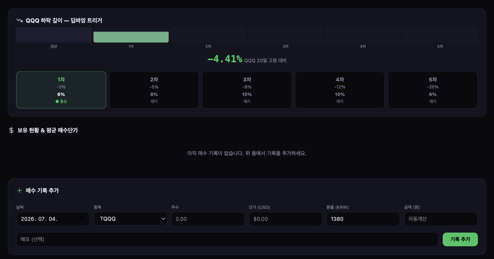
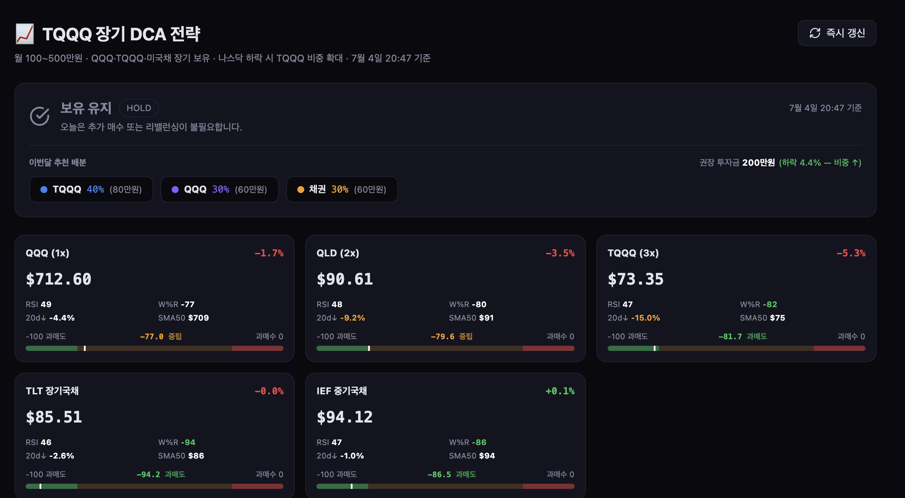

# TQQQ 장기 DCA 물타기 전략 — 사용 가이드

> **대상**: CASSANDRA AI 로그인 사용자 전체  
> **URL**: https://dart-monitor-pi.vercel.app/tqqq  
> **최종 업데이트**: 2026-07-04

---

## 이 페이지가 하는 일

나스닥100 하락 시 TQQQ(3배 레버리지 ETF)를 계획적으로 물타기하고, 자신의 매수 기록을 저장·관리하는 개인 투자 메모 도구입니다.3배 레러버리지는 고위험 상품으로 횡보장에서 원금 손실이 크게 발생합니다.

- **실시간 시세**: QQQ·TQQQ·QLD·TLT·IEF 현재가 + RSI·Williams %R·낙폭
- **딥바잉 트리거**: QQQ 20일 고점 대비 낙폭으로 매수 타이밍 자동 판단
- **개인 매수 기록**: 로그인 계정별로 독립 저장 — 다른 유저의 기록과 완전 분리
- **평균단가 계산**: 종목별 평단·총 투자금·수익률 자동 계산
- **DCA 시뮬레이션**: 월 100 ~ 500만원 × 5~20년 시나리오 비교

---

## 시작 방법

### 1단계: 로그인

[https://dart-monitor-pi.vercel.app/login](https://dart-monitor-pi.vercel.app/login)에서 **Google 로그인**을 하빈다.

> 구글 계정 하나만 있으면 바로 사용할 수 있습니다. 개인 정보는 구글 로그인의 최소 정보와 투자 추적을 위한 데이터만 남깁니다.

### 2단계: TQQQ 페이지 접속

로그인 후 상단 메뉴 → **퀀트** → TQQQ 페이지, 또는 직접 접속
`https://dart-monitor-pi.vercel.app/tqqq`

---

## 화면 구성


*메인 화면: 오늘의 액션 카드 · 추천 배분 · 실시간 시세*

### 오늘의 액션 카드

상단에 오늘 해야 할 행동을 한 줄로 알려줍니다.

| 메시지 | 의미 |
|--------|------|
| **매수 타이밍** | QQQ가 20일 고점 대비 -3% 이상 하락 → TQQQ 물타기 적기 |
| **월 정기 매수** | 이번달 매수 기록 없고 15일 이후 → DCA 실행 알림 |
| **리밸런싱 권장** | TQQQ 비중 42% 초과 + 하락 없음 → QQQ·채권으로 일부 이동 |
| **급등 주의** | QQQ 당일 +2% 이상 상승 → 신규 진입 자제 |
| **보유 유지** | 특별한 액션 불필요 |

하단에 **이번달 추천 배분**도 표시됩니다:
- 하락 -8% 이상: TQQQ 60% · QQQ 20% · 채권 20%
- 하락 -5~8%: TQQQ 50% · QQQ 25% · 채권 25%
- 하락 -3~5%: TQQQ 40% · QQQ 30% · 채권 30%
- 평시: TQQQ 30% · QQQ 40% · 채권 30%

---

### 실시간 시세 카드

| 카드 | 설명 |
|------|------|
| **QQQ (1x)** | 나스닥100 추종 ETF 기준 지수 |
| **QLD (2x)** | 2배 레버리지, 중간 리스크 |
| **TQQQ (3x)** | 3배 레버리지, 물타기 주요 대상 |
| **TLT** | 미국 장기국채 ETF (20년+), 안전자산 |
| **IEF** | 미국 중기국채 ETF (7~10년) |

각 카드에 **RSI**(과매도<30/과매수>70), **Williams %R**, **20일 고점 대비 낙폭**, **SMA50** 표시.

---

### QQQ 하락 미터 — 딥바잉 트리거


*하락 미터(딥바잉 트리거) · 보유 현황 · 매수 기록 추가 폼*

QQQ 20일 고점 대비 낙폭을 6단계로 시각화합니다.

| 단계 | 낙폭 | 의미 | 추천 행동 |
|------|------|------|-----------|
| 정상 | 0~3% | 관망 | DCA 유지 |
| 1차 | 3~5% | 약한 신호 | TQQQ 소폭 추가 |
| 2차 | 5~8% | 매수 신호 | TQQQ 적극 추가 |
| 3차 | 8~12% | 강한 신호 | TQQQ 집중 매수 |
| 4차 | 12~20% | 딥바잉 | 준비금 투입 |
| 5차 | 20~35% | 최대 위기 | 분할 전량 투입 |

---

### 매수 기록 추가

**"매수 기록 추가"** 폼에서 내 매수 내역을 입력합니다.

| 필드 | 설명 | 예시 |
|------|------|------|
| 날짜 | 매수 날짜 | 2026-07-04 |
| 종목 | TQQQ · QLD · QQQ · TLT · IEF | TQQQ |
| 주수 | 매수한 주 수 | 10 |
| 단가(USD) | 매수 체결가 | 62.50 |
| 환율(KRW) | 매수 당시 환율 (기본 1380) | 1380 |
| 금액(원) | 주수×단가×환율 자동 계산 | 862,500 |
| 메모 | 자유 메모 | 나스닥 -5% 딥바잉 |

> **팁**: 단가와 주수, 환율을 입력하고 금액 필드를 클릭하면 **원화 금액이 자동 계산**됩니다.

입력 후 **기록 추가** 버튼을 누르면 내 계정에 저장됩니다.  
저장된 기록은 **로그아웃 후 재로그인해도 그대로 유지**됩니다.

---

### 보유 현황 & 평균단가

매수 기록이 쌓이면 자동으로 계산됩니다.

- **총 투자금**: 전체 매수 원화 합계
- **평가금액**: 현재가 × 총 주수 × 마지막 환율
- **수익률**: (평가금액 - 투자금) / 투자금
- **종목별 평균단가**: 가중평균 매수단가

---

### DCA 장기 시뮬레이션

월 정기 투자금과 기간을 입력하면 예상 수익을 보여줍니다.

| 전략 | CAGR 가정 | 설명 |
|------|-----------|------|
| QQQ (1x) | 13% | 가장 안정적, 변동성 감쇄 없음 |
| QLD (2x) | 19% | 중간 리스크, 연 2~4% 감쇄 |
| TQQQ (3x) | 24% | 고위험·고수익, 연 7% 감쇄 |
| 혼합 DCA | 17% | QQQ 40%+QLD 30%+TQQQ 30% |

예시 — 월 200만원 × 10년:

| 전략 | 예상 자산 | 납입 대비 |
|------|-----------|-----------|
| QQQ | 약 4.7억 | 2.0배 |
| QLD | 약 7.3억 | 3.0배 |
| TQQQ | 약 11억 | 4.6배 |
| 혼합 | 약 6.5억 | 2.7배 |

> ⚠️ CAGR은 2010~2026 강세장 기준 역사적 추정치입니다. 미래를 보장하지 않습니다.

---

## 전략 핵심 원칙

### 평시 DCA (매월 정기 매수)

```
TQQQ 30% + QQQ 40% + 채권(TLT/IEF) 30%
매월 15일 전후 정기 매수
권장 월 투자금: 100~500만원
```

### 하락 시 TQQQ 비중 확대

```
QQQ -3~5%:  TQQQ 40%, QQQ 30%, 채권 30%
QQQ -5~8%:  TQQQ 50%, QQQ 25%, 채권 25%
QQQ -8% 이상: TQQQ 60%, QQQ 20%, 채권 20%
```

### 리밸런싱 조건

```
TQQQ 비중 42% 초과 + 하락 없을 때 → QQQ·채권으로 이동
반등 +15% 이상 시 → 절반 익절 고려
연 1회 채권 비중 정기 점검
```

---

## 자주 묻는 질문

**Q. 내 매수 기록이 다른 사람에게 보이나요?**  
A. 아니요. 로그인한 계정 이메일로 완전히 분리됩니다. 다른 유저의 기록은 볼 수 없고 내 기록에 영향을 주지 않습니다.

**Q. 구글 로그인이 아니면 사용할 수 없나요?**  
A. 구글 로그인 외에도 관리자로부터 초대받은 이메일/비밀번호 계정으로도 사용할 수 있습니다.

**Q. TQQQ는 왜 위험한가요?**  
A. 3배 레버리지 ETF는 나스닥100이 장기 횡보하거나 하락하면 지수보다 더 큰 손실이 납니다 (변동성 감쇄, Volatility Decay). 예를 들어 나스닥이 -10%이면 TQQQ는 약 -30%입니다. **전체 투자금의 일부만 TQQQ에 배분하고, 나머지는 QQQ와 채권으로 분산하는 것이 핵심**입니다.

**Q. 시세는 얼마나 자주 업데이트 되나요?**  
A. Yahoo Finance 실시간 데이터를 사용하며, 30분 Redis 캐시가 적용됩니다. 우상단 **즉시 갱신** 버튼으로 강제 갱신 가능합니다.

**Q. 매수 기록을 삭제하면 복구가 되나요?**  
A. 삭제 시 복구가 불가능합니다. 실수로 삭제하지 않도록 주의하세요.

---

## 위험 고지

> ⚠️ **이 페이지는 개인 투자 메모 도구이며 투자 권유가 아닙니다.**
>
> - TQQQ는 3배 레버리지 ETF로, 단기간 -30~-70% 손실이 발생할 수 있습니다
> - 2020년 3월 코로나 쇼크: TQQQ -70% / 2022년 금리 인상: TQQQ -80%
> - 레버리지 ETF는 장기 횡보·하락장에서 변동성 감쇄로 지수보다 더 큰 손실 발생
> - 한국 거주자: 해외주식 양도소득세 22% (연 250만원 공제 후)
> - 백테스트 CAGR은 AI 슈퍼사이클 강세장(2010~2026) 기준 — 미래 수익 미보장
> - 모든 투자 결정은 본인의 판단과 책임 하에 이루어져야 합니다

---

## 관련 링크

- [AMQS 퀀트 전략 (GitHub)](https://github.com/gameworkerkim/vibe-investing/tree/main/01.Trading%20Strategy/Adaptive%20Momentum%20Quant%20Strategy%20(AMQS))
- [퀀트 대시보드](/quant)
- [CASSANDRA AI 메인](/)
